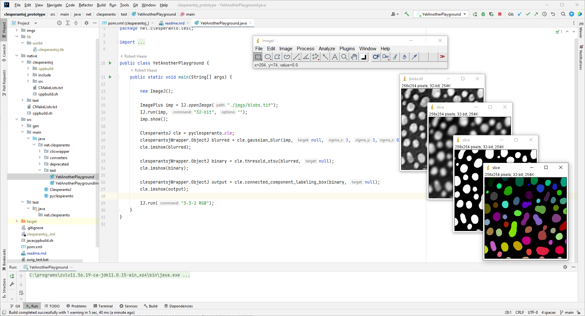

## Preliminary build instructions

Please note this project is in very early stages.
It is expected these build instructions will change and become more robust as the project evolves.
The current build instructions are for early adapters to test and give us feedback.  Where things need improvement we've added notes and are very happy to get feedback.

This repository focus on building a prototype version of a Java wrapper around the library `CLIc`. To do so, we will use the `javacpp` library, and rely on `Maven` and `Cmake` to build the project.

## pre-requisites
### Install a C++ compiler

This is required to compile the library `CLIc`.

**For windows** look at the [CLIc_prototype windows build guide](https://github.com/clEsperanto/CLIc_prototype/blob/master/docs/windows_build/windows_build.md) and install Microsoft Build tools (or Visual Studio Community edition) as explained [here](https://biapol.github.io/blog/robert_haase/ms_build_tools/) (*Hint:* during installation, activate Windows C++ development).

Make sure the path to the MSVC compiler is in your PATH, e.g.:
```bash
setx PATH "%PATH%;C:\Program Files (x86)\Microsoft Visual Studio\2019\Community\VC\Tools\MSVC\14.29.30133\bin\Hostx64\x64"
```

**For linux**, you can use the gcc compiler. It can be installed using the package manager of your distribution. For example, on Ubuntu, you can install it using the following command:
```bash
sudo apt-get install build-essential
```
(*Hint:* other compilers such as clang are also supported.)

**For mac**, you can use the default clang compiler shiped with XCode. It can be installed using the following command:
```bash
sudo xcode-select --install
```

### Install OpenCL

You need to have a valide OpenCL installation on your machine. 

**For windows**, using the Nvidia distribution of OpenCL version 11.2. And make sure the path to the OpenCL include and lib folders are in the PATH, e.g.:
```bash
setx PATH "%PATH%;C:\Program Files\NVIDIA GPU Computing Toolkit\CUDA\v11.2\include;C:\Program Files\NVIDIA GPU Computing Toolkit\CUDA\v11.2\lib\x64"
```

**For linux**, make sure you have the OpenCL headers installed. For example, on Ubuntu, you can install it using the following command:
```bash
sudo apt-get install ocl-icd-opencl-dev
```

**For mac**, systems are already shipped with OpenCL. Nothing to do.

**Note:** If your OpenCL install is available in your PATH, then the `CLIc` will find it and link to it.

### Java Development Kit

Download and install a Java-Development-Kit (JDK), preferably version 11, e.g. from [azul](https://www.azul.com/downloads/?package=jdk#download-openjdk). And set the environment variable JAVA_HOME to a valid SDK, 

e.g. **for windows**:
```bash
setx JAVA_HOME C:\Users\rober\.jdks\azul-11.0.14.1\
echo %JAVA_HOME%
```

e.g. **for linux**:
```bash
JAVA_HOME='/usr/lib/jvm/java-11-openjdk-amd64'
PATH=$PATH:$JAVA_HOME/bin
export PATH
```

### Maven

Download [apache-maven](https://maven.apache.org/download.cgi), unzip it and make it part of PATH.

e.g. **for windows**:
```bash
setx PATH "%PATH%;C:\programs\apache-maven-3.8.4-bin\apache-maven-3.8.4\bin"
echo %PATH%
```

e.g. **for linux**:
```bash
M2_HOME='/opt/apache-maven-3.6.3/'
PATH=$PATH:$M2_HOME/bin
export PATH
```

### git

Install [git-scm](https://git-scm.com/downloads) and add it to the PATH, 

e.g. **for windows**:
```bash
setx PATH "%PATH%;C:\Program Files\Git\cmd"
echo %PATH%
```

e.g. **for linux**, this can be install by using the package manager of your distribution. For example, on Ubuntu, you can install it using the following command:
```bash
sudo apt-get install git
```

### cmake

Download and install [cmake](https://cmake.org/download/). Do not forget to add it to the PATH.

### CLIc_prototype

IF OpenCL is in your `PATH`, the download, build, and install of CLIc_prototype should be automatic as it is managed by `CMake`.

## Build clesperantoj_prototype

In a Terminal, navigate to the root directory of this project and run 
```bash
mvn
```
**For windows**, please use the `x64 Native Tools Command Prompt for VS 2019 (64 bit!)`

## Running the prototype

After the build succeeded, you can run the main functions in [this package](https://github.com/clEsperanto/clesperantoj_prototype/tree/main/src/main/java/net/clesperanto/test) and play with clesperantoj. 
This is recommended to do from an IDE such as IntellIJ by clicking on the green triangle next to the main function:



## Trouble shooting

* Take a look at the ```javacpp``` section of the poml.xml and make sure the ```includePath``` and ```linkPath``` locations exist on your machine.

* Sometimes we had to make a trivial change to [clesperantoj][https://github.com/clEsperanto/clesperantoj_prototype/blob/javacpp/src/main/java/net/clesperanto/clicwrapper/clesperantoj.java], like adding a space, to activate the parser that generated the java wrapper.)

* In some cases, the build fails when executed the first time. 
You find a potential workaround explained [here](https://github.com/clEsperanto/clesperantoj_prototype/issues/4#issuecomment-1184768674).

* You may need to add the src/gen/java path to the java build path in your IDE.

  * For Eclipse follow below instructions

1.  Go to Project -> Properties -> Java Build Path -> Source (tab). Then add src/main as a source folder.
2. Right-clicking your project, then click Properties .
3. In the left pane, click Java Build Path . In the right pane, select the Source tab .
4. Here you can add/edit/remove source folders.

* How to add variable to the PATH in Windows using the GUI
  * Right-click on the Start button and select System.
  * Click on Advanced system settings.
  * Click on Environment Variables.
  * Under System variables, click on Path and click Edit.
  * Click on New and add the path to the variable.
  * Click OK to save the changes.
  
## Acknowledgements
This project was supported by the Deutsche Forschungsgemeinschaft under Germany’s Excellence Strategy – EXC2068 - Cluster of Excellence "Physics of Life" of TU Dresden.
This project has been made possible in part by grant number [2021-237734 (GPU-accelerating Fiji and friends using distributed CLIJ, NEUBIAS-style, EOSS4)](https://chanzuckerberg.com/eoss/proposals/gpu-accelerating-fiji-and-friends-using-distributed-clij-neubias-style/) from the Chan Zuckerberg Initiative DAF, an advised fund of the Silicon Valley Community Foundation.
